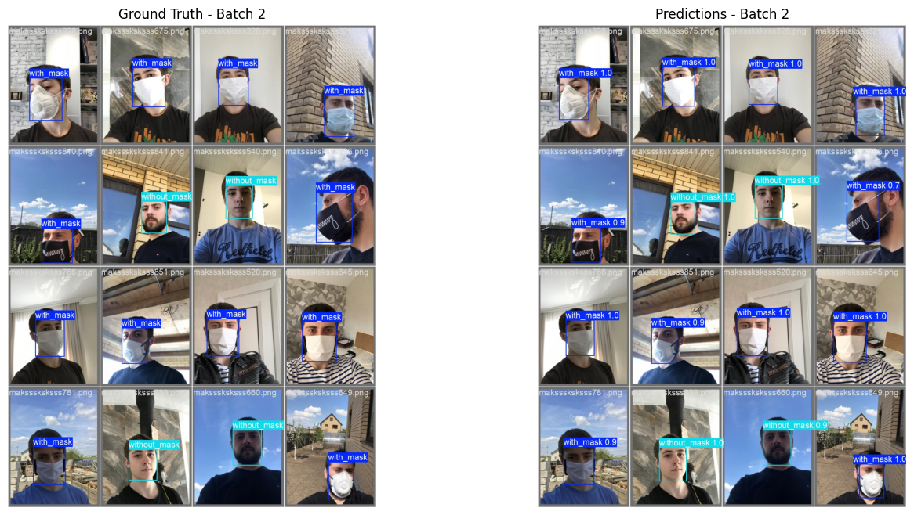
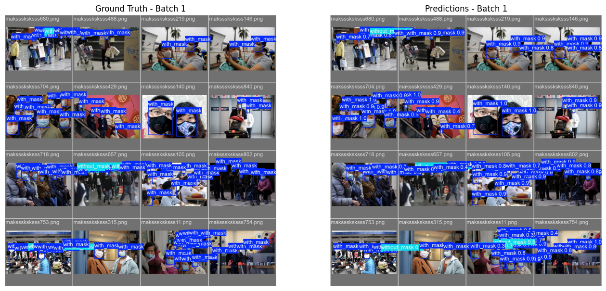
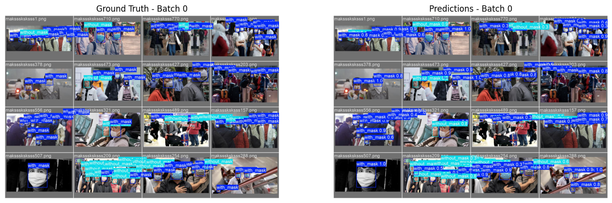

# object_dectection
# Mask Detection using YOLOv8

Phát hiện và phân loại tình trạng đeo khẩu trang trên khuôn mặt bằng mô hình YOLOv8 (Ultralytics).

## Mục tiêu dự án

Xây dựng hệ thống **object detection** tự động phát hiện khuôn mặt và phân loại thành các lớp:
- `with_mask` – Đeo khẩu trang đúng cách
- `without_mask` – Không đeo khẩu trang

Ứng dụng thực tế: giám sát an toàn y tế, camera công cộng, ứng dụng di động kiểm tra khẩu trang.

## Dataset

- **Tên dataset**: MaskFace (Face Mask Detection)
## Công nghệ sử dụng

- **Framework**: Ultralytics YOLOv8 (phiên bản nano – `yolov8n.pt`)
- **Ngôn ngữ**: Python 3.12
- **Môi trường huấn luyện**: Kaggle Notebook (GPU: NVIDIA Tesla T4)
- **Thư viện chính**:
  - ultralytics
  - opencv-python
  - matplotlib
  - pillow

## Kết quả nổi bật
- **Precision**: ~0.82  
- **Recall**: ~0.78  
- **F1-score**: ~0.80

## Kết quả minh họa 

